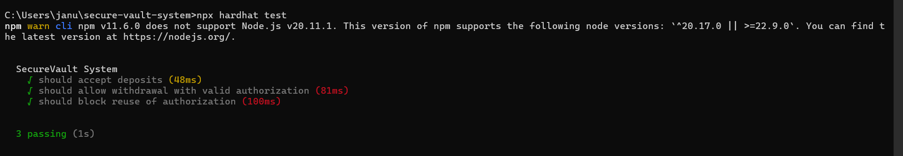
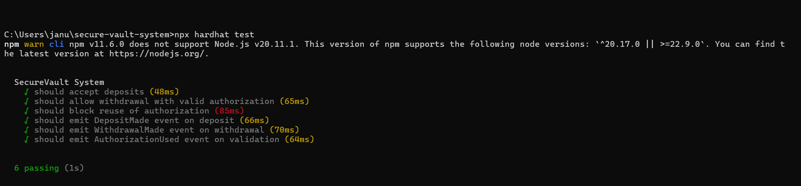

# 🔐 Secure Vault System


> A secure, event‑driven vault system demonstrating Solidity best practices, reproducible testing, and portfolio‑ready documentation.  
> A Solidity vault system showcasing secure authorization, event transparency, and reproducible testing.

A Solidity-based **multi-tenant vault** with authorization management, built and tested using **Hardhat + ethers v5**.  
This project demonstrates secure deposit/withdrawal flows, one-time authorization enforcement, and event transparency.

---

## 🌟 Project Highlights
- Multi-tenant vault with one-time authorization enforcement
- Transparent event logging for deposits, withdrawals, and authorizations
- Fully tested with Hardhat + ethers v5
- Portfolio-ready with reproducible setup and visual proof
- Clean architecture and professional documentation

---

## 📂 Project Structure

```
secure-vault-system/
├── contracts/
│   ├── AuthorizationManager.sol
│   └── SecureVault.sol
├── test/
│   └── system.spec.js
├── docs/screenshots/
│   ├── phase5-tests.png
│   ├── phase6-tests.png
│   └── deployment.png
├── hardhat.config.js
├── docker-compose.yml
├── Dockerfile
├── .gitignore
├── package.json
└── README.md
```

---

## 🛠️ Technologies Used
- Solidity (v0.8.20)
- Hardhat (v2.22.5)
- ethers.js (v5.7.2)
- Mocha/Chai for testing
- @nomiclabs/hardhat-waffle (v2.0.6)
- Node.js (v20.11.1)
- Docker & Docker Compose

---

## ⚙️ Setup Instructions

1. **Clone the repo**  
   ```bash
   git clone <your-repo-url>
   cd secure-vault-system
   ```

2. **Install dependencies**  
   ```bash
   npm install
   ```

3. **Compile contracts**  
   ```bash
   npx hardhat compile
   ```

4. **Run tests**  
   ```bash
   npx hardhat test
   ```

5. **Run with Docker**  
   ```bash
   docker-compose up --build
   ```

---

## 🏗️ Contracts

### `AuthorizationManager.sol`
- Tracks used authorizations (`mapping(bytes32 => bool)`).
- Validates one-time authorization requests.
- Emits `AuthorizationUsed(authId)` when consumed.

### `SecureVault.sol`
- Accepts ETH deposits.
- Withdraws ETH only with valid authorization.
- Emits:
  - `DepositMade(sender, amount)`
  - `WithdrawalMade(recipient, amount)`

---

## 🔄 How It Works
1. Users deposit ETH into the SecureVault.
2. To withdraw, they must present a unique authorization ID.
3. The AuthorizationManager validates the ID and ensures it cannot be reused.
4. Events are emitted at each step for transparency and auditability.

---

## 🧪 Testing

All tests are written in **Mocha/Chai** with Hardhat.  
Run with:
```bash
npx hardhat test
```

### Phase 5: Functional Validation
- ✔ Accepts deposits  
- ✔ Allows withdrawal with valid authorization  
- ✔ Blocks reuse of authorization  

### Phase 6: Event Validation
- ✔ Emits `DepositMade` on deposit  
- ✔ Emits `WithdrawalMade` on withdrawal  
- ✔ Emits `AuthorizationUsed` on validation  

---

## 📸 Visual Proof

### Phase 5: Functional Validation


### Phase 6: Event Validation


---

## 🗂️ Architecture Diagram

```text
+-------------------+        +---------------------+
|   SecureVault     |        | AuthorizationManager|
|-------------------|        |---------------------|
| - deposit()       |        | - validate(authId)  |
| - withdraw() ---> |------> | - usedAuthorizations|
|                   |        |                     |
+-------------------+        +---------------------+
```

---

## 📌 Notes
- Built on **Node.js v20.11.1** with **ethers v5**.  
- Uses **Hardhat Waffle matchers** for `.revertedWith` and event assertions.  
- Demonstrates reproducible backend setup with clean tests and event transparency.  

---

## 🚀 Future Improvements
- **Role-Based Access Control (RBAC):** Admin/user roles for controlled access.  
- **Multi-Tenant Expansion:** Isolated balances per tenant.  
- **Frontend Integration:** React/Next.js UI with MetaMask.  
- **Gas Optimization:** Benchmark and optimize storage/events.  
- **Audit & Security Enhancements:** OpenZeppelin libraries for safety and upgradeability.  
- **IPFS Integration:** Off-chain storage proofs.  
- **CI/CD Automation:** GitHub Actions for continuous testing.  
- **Upgradeable Contracts:** Proxy pattern for future upgrades.  
- **Layer 2 Deployment:** Polygon/Arbitrum integration for scalability.  
- **Hardhat Gas Reporter:** Benchmark gas usage during tests.

---

## 📜 License
This project is licensed under the MIT License.

---

## 🤝 Contributing
Contributions, issues, and feature requests are welcome!  
Feel free to fork this repo and submit a pull request.

---

## 🙏 Acknowledgements
- OpenZeppelin for security patterns  
- Hardhat community for tooling and plugins  

---

## ✅ Status
- Phase 5 complete (functional validation).  
- Phase 6 complete (event validation).  
- Visual proof screenshots committed.  
- Release `v1.0.0` published.  
- Repo description and topics added.  
- Ready for portfolio submission with screenshots, documentation, and architecture diagram.
```

---